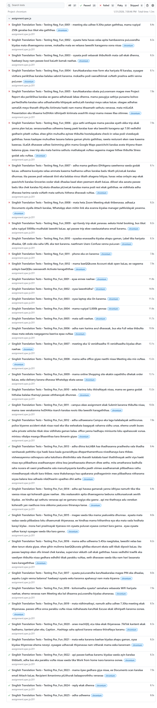

# 📝 Singlish to Sinhala Translator Automation Project
### ITPM - Assignment 01 | Quality Assurance (QA)

This repository contains a comprehensive automated testing suite designed for the SwiftTranslator web application. The project focuses on ensuring a seamless user experience by validating the core engine that converts phonetic Singlish input into accurate Sinhala script.

---

## 👤 Student Information
| Field | Details |
| :--- | :--- |
| **Name** | Perera P.H.C.K |
| **Student ID** | IT23640702 |
| **Specialization** | Information Technology |
| **Option Selected** | Option 1 (Singlish to Sinhala) |

---

## 🛠 Tech Stack
- **Framework:** [Playwright](https://playwright.dev/)
- **Language:** JavaScript (Node.js)
- **Reporting:** Playwright HTML Reporter
- **Source Control:** GitHub

---

## 🚀 Getting Started

### 1. Prerequisites
Ensure you have **Node.js** installed on your system. You can check it by running:
```bash
node -v
```

### 2. Installation
Clone this repository to your local machine and install the dependencies:

###### Clone the repository
```bash
git clone https://github.com/chamod148/IT-Project-Management.git
```

###### Navigate into the folder
```bash
cd ITPM
```

###### Install Node modules
```bash
npm install
```

###### Install Playwright browsers
```bash
npx playwright install
```
---

## 🧪 Test Execution Commands
You can run the tests using the following terminal commands:

| Task | Command |
| :--- | :--- |
| Run All Tests (Headed) | npx playwright test --headed |
| Run Accuracy Tests | npx playwright test tests/assignment.spec.js --headed |
| Run UI-Related Tests | npx playwright test tests/ui_test.spec.js --headed |
| View Test Report | npx playwright show-report |

---

## 📁 Project Structure
```text
├── tests/
│   ├── assignment.spec.js   # Accuracy validation scenarios (24+ cases)
│   └── test.spec.js         # UI-related scenarios (Reset/Clear functionality)
├── playwright.config.js     # Playwright configuration
├── package.json             # Project dependencies
├── README.md                # Project documentation

```

---

## 📊 Test Scenarios Covered
Accuracy Validation: Testing complex sentences, mixed languages, punctuation, and numerical data.

UI Functionality: Verification of the "Clear" button to ensure it properly resets the input and output fields.

---

## 📊 Test Execution Report
Here is the summary of the test execution results:



---
